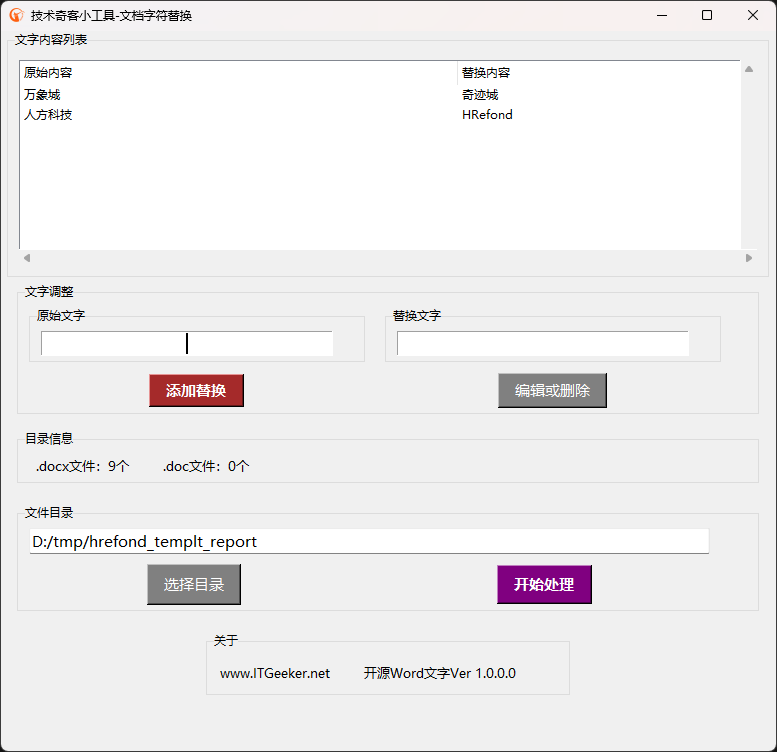

# Office Word文字替换小工具 - 开源Word文字替换工具

#### 介绍
技术奇客出品的Office系列小工具 - Office Word文字替换工具。

    - 可指定目录，软件会处理该目录的所有docx文件。
    - 可进行批量处理。
    - 替换内容不能包含原始内容。
    - 已替换文件带有-replaced字样，保存在子目录《已替换文件》中。

此工具只支持新版docx文件，若要处理旧版的doc文件，建议使用技术奇客开发的开源工具 - [Word格式转换(.doc ➡ .docx) [点击下载并安装]](https://www.itgeeker.net/itgeeker-technical-service/itgeeker_convert_doc_to_docx/)

技术奇客是奇客罗方智能科技的关联公司。更多信息可访问 ITGeeker技术奇客官方博客 [www.itgeeker.net](https://www.itgeeker.net) 或者 GeekerCloud奇客罗方智能科技 [https://www.geekercloud.com](https://www.geekercloud.com)

>软件下载

[下载Office Word文字替换工具](https://www.itgeeker.net/itgeeker-technical-service/itgeeker_word_str_replacement/)

>工具运行主界面

#### 软件架构
软件采用Python 3.11版本结合TKinter UI开发，可以运行于Windows 10/11。软件基于Office Word软件对.docx格式文件进行处理，前提必须安装Word软件。
理论上软件也可以运行于Linux系统，但需要依赖LibreOffice。 Linux系统运行功能正在开发中。

    - Windows系统请下载发行版的exe可执行文件即可。
    - Linux理论上只要是Python 3的环境都可直接运行。

#### 运行及使用说明

> Windows版本

    1.  下载可执行文件
    2.  双击文件并执行
    3.  添加想要移除的文本列表
    4.  选择要处理的文档所在的目录
    5.  开始处理

> Linux版本

    1.  确定你又安装Python 3版本，最好3.8以上版本
    2.  安装Python依赖："pip install python-docx tkinter"
    3.  下载本项目到本地目录，并运行："python remove_str_from_word_main.py"

处理过的文件将被保存到子目录“已替换文件”当中，文件名末尾附上“-replaced”字样以示区别。

#### 更新日志

> 2023-06-27 v1.0.0.0
 
    1. 第一版本发布

#### 参与贡献

    1.  Fork 本仓库
    2.  新建 Feat_xxx 分支
    3.  提交代码
    4.  新建 Pull Request

#### 其他

    1.  阅读README.en.md可以查看英文指导
    2.  ITGeeker 官方博客 [www.itgeeker.net](https://www.itgeeker.net)
    3.  Gitee开源项目地址 [https://gitee.com/itgeeker/itgeeker_word_str_replacement](https://gitee.com/itgeeker/itgeeker_word_str_replacement) 
    4.  Github开源项目地址 [https://github.com/alanljj/itgeeker_word_str_replacement](https://github.com/alanljj/itgeeker_word_str_replacement) 
    5.  GeekerCloud奇客罗方智能科技 [https://www.geekercloud.com](https://www.geekercloud.com)
